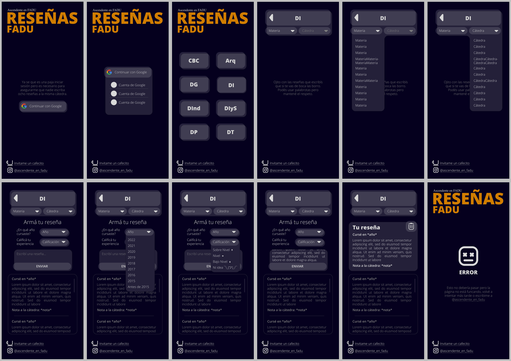
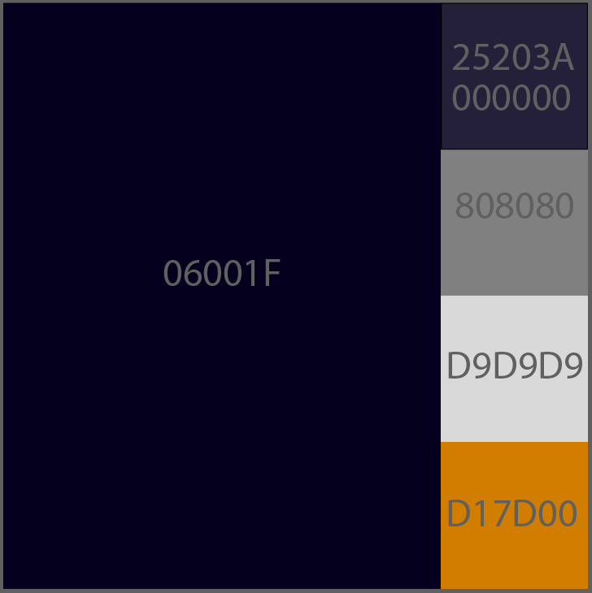

# Diseño de UI

Acá están todas las pantallas de la página, en varios casos de uso.

## Resumen

## Convenciones de estilo

La paleta de colores a utilzar será:  

Y las fuentes:
- Open Sans Extra Bold
- Open Sans Semi Bold
- Open Sans Light
- Times New Roman Regular
